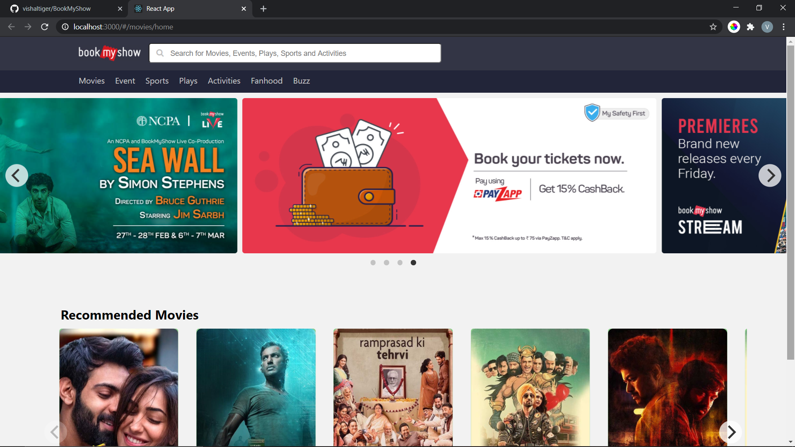
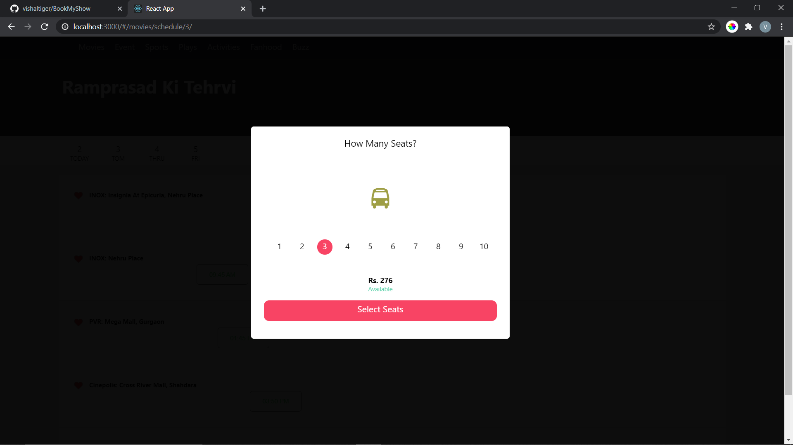
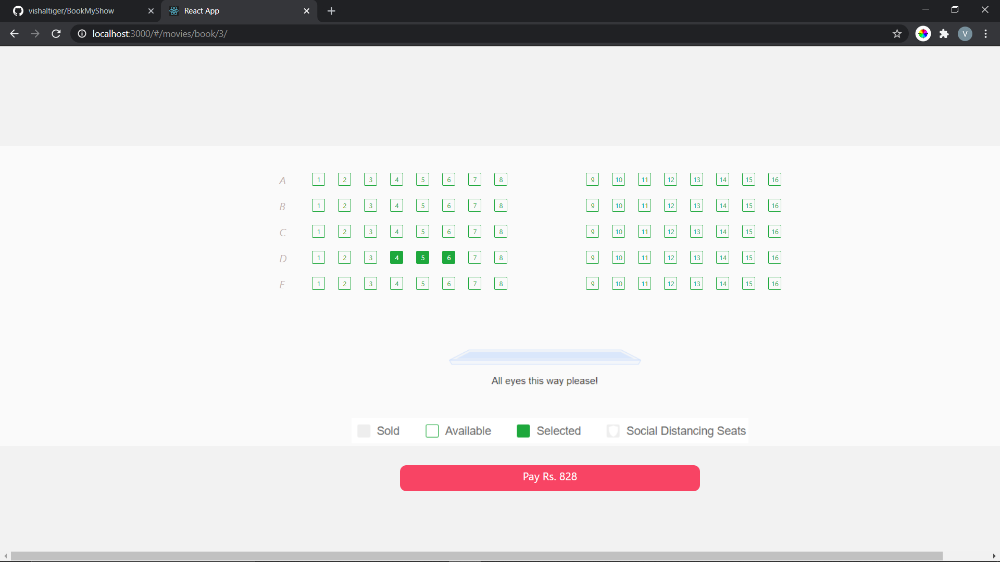
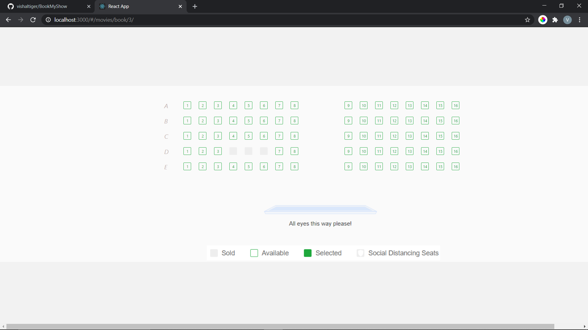
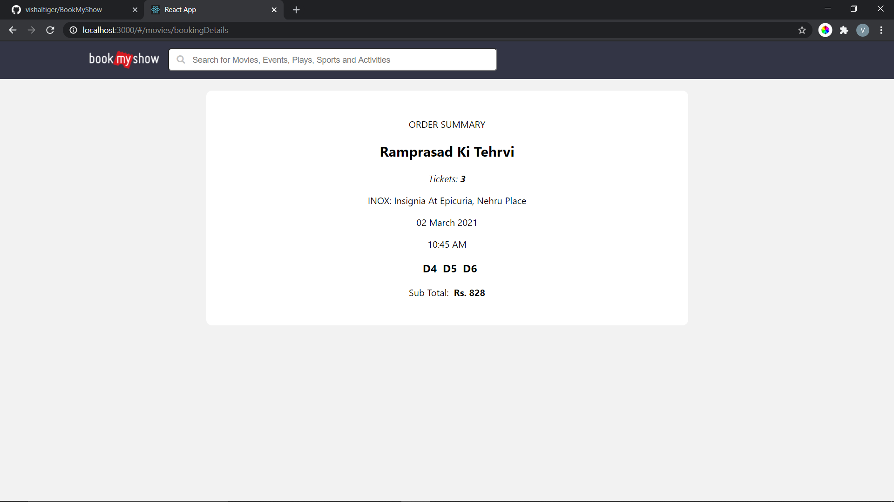

<h1>How To Run</h1>

steps:
1.Go to bookmyshow directory after cloning from github. 
  2.Open cmd prompt and run cmd <i><strong>npm install</strong></i> 
  3.Then to install sass run  <i><strong>npm install -g sass</strong></i>  
  4.go to bookmyshow/src directory and run cmd  <i><strong>sass --watch </strong></i> 
  5.then start the application by "npm start".    

<h3>Home</h3>

<h3>Movie Screen</h3>

<h3>No. Of Seats</h3>

<h3>Seats</h3>

<h3>Seleacted Setas</h3>

<h3>Booking Details</h3>
